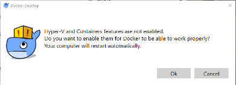
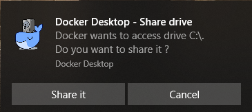

# PostgreSQL Setup for Local Development

1.  Download and Install Docker CE:

    [Windows](https://hub.docker.com/editions/community/docker-ce-desktop-windows)
    or [MacOS X](https://hub.docker.com/editions/community/docker-ce-desktop-mac)

    a.  If prompted, choose to use Linux Containers during installation.

    b.  On Windows, you may be forced to log off after the install
        completes.

    c.  On Windows, if the Hyper-V and Containers features are disabled you
        will see the prompt below. Save your work, press Ok, and wait
        for your computer to restart.
        
       

2.  Execute the following docker commands from the CLI:
    
    a.  On Windows, you may be asked to authorize the drive sharing as shown
       below. Press the "Share It" button to allow access.

    
    
    b. Execute the following command on Linux or MacOS:

    ``` bash
    docker run --name postgres -d -p 5432:5432 \
    --env POSTGRES_PASSWORD=password --env POSTGRES_USER=swirlds \
    --env POSTGRES_DB=fcfs \
    --env PGDATA=/var/lib/postgresql/data/pgdata \
    postgres:10.14-alpine 
    ```
    
    c. Execute the following command on Windows:
    
    ``` bash
    docker run --name postgres -d -p 5432:5432 ^
    --env POSTGRES_PASSWORD=password --env POSTGRES_USER=swirlds ^
    --env POSTGRES_DB=fcfs ^
    --env PGDATA=/var/lib/postgresql/data/pgdata ^
    postgres:10.14-alpine 
    ```

3.  Control your PostgresSQL container with the following commands:

    a. Start Postgres
   
    ``` bash
    docker start postgres
    ```

    b. Stop Postgres

    ``` bash
    docker stop postgres
    ```

    c. List Running Containers
    
    ``` bash
    docker ps
    ```

    d. List all Registered Containers
    
    ``` bash
    docker ps -a
    ```